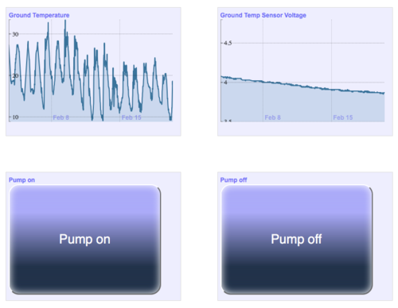

# Cutie

Cutie is a simple way to generate dashboards for IoT devices, particularly for displaying sensor information, alerting on particular conditions and issuing commands.



It can currently ingest data from MQTT servers (hence the name...) but is designed to be expandable to other data sources.

## Features

* Graphing sensor input on user-definable scales
* Customizable data retention length
* Condition-based, rate-limited alerting via SMS (e.g. send SMS once per hour if `value < 4`)
* Action buttons on the dashboard which dispatch Unix commands

## Getting started

You'll need [Node.JS](https://nodejs.org/) installed. Then run:

```
npm install
```

to install all the Javascript library dependencies. Next, copy `config_example.json` to `config.json` and customize for your deployment environment.

Finally, run `node server.js` to start the web server. Hint: we use [PM2](http://pm2.keymetrics.io) to daemonize the web server and get it running on boot:

```
pm2 start server.js
pm2 startup
```

## License

Copyright 2018 Simon Cozens

Permission is hereby granted, free of charge, to any person obtaining a copy of this software and associated documentation files (the "Software"), to deal in the Software without restriction, including without limitation the rights to use, copy, modify, merge, publish, distribute, sublicense, and/or sell copies of the Software, and to permit persons to whom the Software is furnished to do so, subject to the following conditions:

The above copyright notice and this permission notice shall be included in all copies or substantial portions of the Software.

THE SOFTWARE IS PROVIDED "AS IS", WITHOUT WARRANTY OF ANY KIND, EXPRESS OR IMPLIED, INCLUDING BUT NOT LIMITED TO THE WARRANTIES OF MERCHANTABILITY, FITNESS FOR A PARTICULAR PURPOSE AND NONINFRINGEMENT. IN NO EVENT SHALL THE AUTHORS OR COPYRIGHT HOLDERS BE LIABLE FOR ANY CLAIM, DAMAGES OR OTHER LIABILITY, WHETHER IN AN ACTION OF CONTRACT, TORT OR OTHERWISE, ARISING FROM, OUT OF OR IN CONNECTION WITH THE SOFTWARE OR THE USE OR OTHER DEALINGS IN THE SOFTWARE.